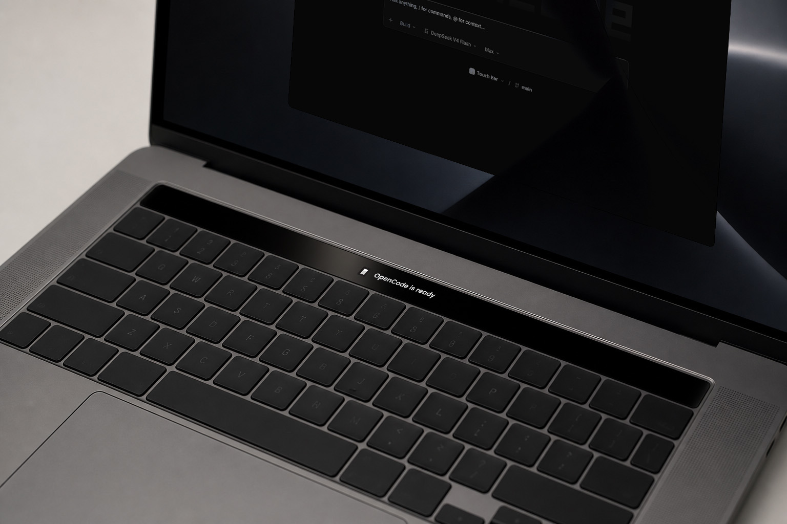

# Agent Status for Pock

<p align="center">
  
</p>

<p align="center">
  <strong>ONE TOUCH BAR. THREE AI CODING AGENTS.</strong>
</p>

<h2 align="center">Works with Claude Code, Codex CLI, and OpenCode</h2>

<p align="center">
  See what your AI agent is doing without switching windows.<br>
  Thinking, editing, running commands, asking questions, and ready states appear live on your Touch Bar.
</p>

<p align="center">
  <a href="https://github.com/therswamhtet/agent-status-pock/actions/workflows/ci.yml"></a>
  <a href="https://github.com/therswamhtet/agent-status-pock/releases/latest"></a>
  <a href="LICENSE"></a>
</p>

## Install

Requirements: macOS 15 or newer, a MacBook Pro with a Touch Bar,
[Pock](https://pock.app) 0.9.0-22 or later, and Python 3. Python is used only to
merge agent hook settings; it is available with Xcode Command Line Tools or
from [python.org](https://www.python.org/downloads/macos/).

Run one command in Terminal. It downloads the latest prebuilt universal release,
installs the widget and local bridge, configures **Claude Code, Codex CLI, and
OpenCode**, and verifies that the bridge started:

```bash
curl -fsSL https://raw.githubusercontent.com/therswamhtet/agent-status-pock/main/install.sh | bash
```

The prebuilt release does not compile project code or require `sudo`. The
installer only writes to your home directory and preserves existing agent
configuration.

After installation:

1. Relaunch Pock from its menu bar icon.
2. Open **Customize Pock** and drag **Agent Status** into the Touch Bar.
3. Restart active Claude Code, Codex CLI, or OpenCode sessions. Codex may ask you to trust the hooks once through `/hooks`.

### Install with an AI agent

Give Claude Code, Codex CLI, OpenCode, or another installation agent this
repository URL:

```text
https://github.com/therswamhtet/agent-status-pock
```

Use this instruction:

```text
Install Agent Status from this repository using its documented one-command installer. Do not modify the repository. Verify http://127.0.0.1:3939/v1/health after installation and report the remaining Pock setup step.
```

### Other install methods

Download `agent-status-pock-<version>-ready.zip` from the
[latest release](https://github.com/therswamhtet/agent-status-pock/releases/latest),
extract it, and run `./install.sh`. To build locally instead:

```bash
git clone https://github.com/therswamhtet/agent-status-pock.git
cd agent-status-pock
./install.sh
```

A source build requires Xcode Command Line Tools and Python 3.

## Features

- **Live activity:** shows thinking, answering, editing, reading, searching, and shell execution with a subtle shimmer.
- **Question alerts:** turns amber when an agent needs input so you know to return to the terminal.
- **Multi-agent status:** follows the most recently active agent; tap the widget to cycle through active agents.
- **Native and local:** the bridge listens only on `127.0.0.1`; no account, cloud service, or telemetry.
- **Universal release:** includes arm64 and x86_64 binaries with no compiler required.
- **Broad Pock compatibility:** resolves PockKit symbols at load time instead of binding to a specific Pock build.

## How It Works

```text
Claude Code ── hooks ──┐
Codex CLI  ─── hooks ──┼──> AgentBridge (127.0.0.1:3939) <── Pock widget
opencode   ─── plugin ─┘              local HTTP polling
```

Agent hooks send small activity events to AgentBridge. The Pock widget polls
the local bridge every 300 ms and renders the latest agent state. AgentBridge
runs as a per-user macOS LaunchAgent from `~/.agentbridge`.

| Activity | Claude Code | Codex CLI | OpenCode |
|---|---:|---:|---:|
| Tool activity | Yes | Yes | Yes |
| Thinking and answering | Yes | Yes | Yes |
| Question alert | Yes | Yes | Not yet |
| Idle and ready | Yes | Yes | Yes |

## Configuration

Widget preferences are available in **Pock > Manage Widgets > Agent Status**.
You can choose which agents appear and toggle the shimmer animation.

| Environment variable | Default | Purpose |
|---|---:|---|
| `AGENTBRIDGE_PORT` | `3939` | Local bridge port |

If you change the port in the LaunchAgent plist, the widget and hooks must use
the same port.

## Troubleshooting

Check bridge health:

```bash
curl -fsS http://127.0.0.1:3939/v1/health
```

Expected response: `{"ok":true}`.

- **Widget is missing:** confirm `AgentTouchBar.pock` exists in `~/Library/Application Support/Pock/Widgets/`, then relaunch Pock.
- **Status does not update:** inspect `~/.agentbridge/logs/stderr.log`, then rerun the installer.
- **Codex hooks do not run:** enter `/hooks` in Codex and trust the AgentBridge hooks.
- **The default Touch Bar returns after sleep:** relaunch Pock. This is a known Pock behavior on newer macOS releases.

When reporting a problem, include your macOS version, Mac architecture, Pock
version, agent name, and bridge log output with sensitive paths removed.

## Uninstall

```bash
~/.agentbridge/uninstall.sh
```

The uninstaller removes Agent Status files and only the hook entries installed
by this project. It preserves unrelated Claude Code, Codex CLI, and OpenCode setup.

## Development

```bash
make bridge
make widget
make test
make install
```

The widget is plain Swift in `widget/Sources/` and builds with `swiftc`; there
is no Xcode project. PockKit is vendored from
[pock/pockkit](https://github.com/pock/pockkit) for compile-time use under its
MIT license. Render tests write each UI state to `widget/dist/` for inspection
without a Touch Bar.

Create a ready-to-use release locally with `./scripts/make-release.sh`.
Version tags matching `v*` are built and published by GitHub Actions.

## Contributing

Bug reports and focused pull requests are welcome. Read
[CONTRIBUTING.md](CONTRIBUTING.md) before submitting a change. For security
issues, follow [SECURITY.md](SECURITY.md) instead of opening a public issue.

## License

Agent Status is open source under the [MIT License](LICENSE).
