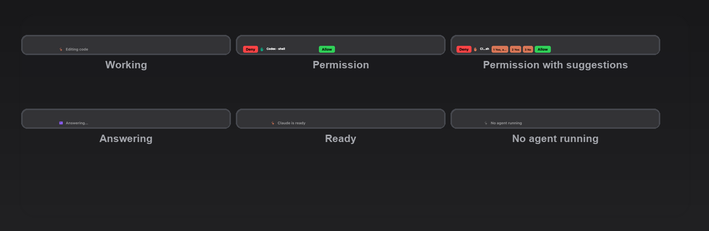

# Agent Status

A [Pock](https://pock.app) widget that shows what your coding agent is doing
right on the MacBook Touch Bar. Works with **Claude Code**, **Codex CLI** and
**opencode**.



## Features

- **Live status.** While an agent works, the bar shows its current activity
  (Thinking, Answering, Editing code, Reading, Searching, Executing shell)
  with a shimmer sweep. Idle agents pulse gently. Finished answers flash
  "Response ready".
- **Tap to approve.** When an agent asks for permission, the widget becomes a
  red **Deny** / green **Allow** prompt, plus numbered buttons (1/2/3) for
  the answers the agent itself suggests. Picking a suggestion echoes an
  "always allow" rule back to the agent, so it stops asking for that
  operation. If you do not answer within 60 seconds, the agent falls back to
  its own prompt.
- **Multi-agent.** Each agent has its own brand color (Claude clay, Codex
  teal, opencode violet). The bar follows the most recently active agent, and
  you can tap it to cycle between them.
- **No PockKit dependency.** The widget resolves its symbols at load time, so
  it runs on any Pock version.
- **Universal build.** arm64 and x86_64, macOS 15 and up.

## Requirements

- macOS 15 or newer on a MacBook Pro with a Touch Bar
- [Pock](https://pock.app) 0.9.0-22 or later
- At least one of: Claude Code, Codex CLI, opencode
- For a source install: Xcode Command Line Tools and Python 3

## Install (recommended, no compiler needed)

Grab the latest **ready-to-use** bundle from the
[Releases page](https://github.com/therswamhtet/agent-status-pock/releases)
(`agent-status-pock-<version>-ready.zip`). It contains the prebuilt `.pock`
widget, the AgentBridge daemon, agent hooks and an installer:

```bash
unzip agent-status-pock-2.3.0-ready.zip
cd agent-status-pock-2.3.0
chmod +x install.sh uninstall.sh
./install.sh
```

Then:

1. Relaunch Pock (menu bar icon, Relaunch), open Customize Pock and drag
   **Agent Status** into your Touch Bar.
2. In Codex, run `/hooks` and trust the AgentBridge hooks. Codex requires
   this for non-managed hooks.
3. Restart your agent sessions.

Why not just the `.pock` file? The widget has no direct connection to your
agents. It polls a small local daemon called **AgentBridge**
(`localhost:3939`) that gathers status and holds permission requests. The
bundle installs all of it at once.

## Install from source

```bash
git clone https://github.com/therswamhtet/agent-status-pock.git
cd agent-status-pock
./install.sh
```

The source installer builds the bridge and the widget locally, then follows
the same steps. See Development below.

## How it works

```
┌──────────────┐   hooks (JSON stdin/stdout)   ┌───────────────┐
│ Claude Code  │ ────────────────────────────► │               │
│ Codex        │ ────────────────────────────► │  AgentBridge  │
│ opencode     │ ── plugin (HTTP POST) ──────► │  localhost    │
└──────────────┘                               │  :3939        │
                                               └───────┬───────┘
                                                       │ HTTP polling (300 ms)
                                               ┌───────▼───────┐
                                               │  Pock widget  │
                                               │ AgentTouchBar │
                                               └───────────────┘
```

1. **AgentBridge** is a tiny local daemon (`~/.agentbridge/bin/agentbridge`)
   run by a LaunchAgent. It aggregates per-agent status and holds permission
   requests for 60 seconds before falling back to the agent's own prompt.
2. **Agent hooks and plugins** push activity events. Claude Code and Codex use
   a shared Python hook. opencode uses a JavaScript plugin. The hooks block on
   permission requests until you tap the Touch Bar.
3. **The Pock widget** (`AgentTouchBar.pock`) polls the bridge every 300 ms,
   renders the status view, and shows the permission prompt as a system modal.

### What each agent reports

| Event | Claude Code | Codex | opencode |
|---|---|---|---|
| Tool activity (Editing, Executing...) | `PreToolUse` | `PreToolUse` | `tool.execute.before` |
| Thinking | `UserPromptSubmit` / `PostToolUse` | same | `message.part.updated` |
| Idle | `Stop` / `SessionEnd` | same | `session.idle` |
| Permission tap | `PermissionRequest` (allow/deny/ask JSON) | `PermissionRequest` (allow/deny JSON) | not supported yet |

## Usage

- **Watch the bar.** Shimmering text means the agent is working. A breathing
  icon means it is idle and waiting for you.
- **Approve permissions.** When the bar becomes a full-width panel, tap
  **Allow** or **Deny**, or tap a numbered suggestion button to allow and
  remember that operation. Pending requests are served one after another.
- **Cycle agents.** Tap the status area to cycle through recently active
  agents. Works in cursor mode too.

### Configuration

The bridge reads these environment variables from the LaunchAgent plist:

| Variable | Default | Purpose |
|---|---|---|
| `AGENTBRIDGE_URL` | `http://127.0.0.1:3939` | Bridge endpoint for hooks, plugin and widget |
| `AGENTBRIDGE_PORT` | `3939` | Bridge listen port |
| `AGENTBRIDGE_TIMEOUT` | `60` | Seconds before an unanswered permission request falls back to the agent's own prompt |

Widget preferences live in Pock, Manage Widgets, Agent Status. You can toggle
which agents appear and the shimmer animation.

## Development

```bash
make bridge    # build AgentBridge (bridge/.build/release/AgentBridge)
make widget    # build dist/AgentTouchBar.pock
make test      # bridge curl tests + widget smoke test + render test
make install   # install everything
```

The widget lives in `widget/Sources/` as plain Swift with a `swiftc` build.
There is no Xcode project. PockKit is vendored under `widget/Vendor/PockKit/`
(MIT, from [github.com/pock/pockkit](https://github.com/pock/pockkit)) and is
used at compile time only. The bundle is linked with
`-undefined dynamic_lookup`, so it has zero PockKit symbol dependencies and
loads in any Pock version.

The render test (`widget/tests/render.swift`) draws every UI state into
`widget/dist/render-*.png` (mirrored in `docs/screenshots/`) so you can check
the visuals without a Touch Bar.

### Releasing

```bash
./scripts/make-release.sh
```

This builds a universal bridge and widgets, then packages
`.release/agent-status-pock-<version>-ready.zip`, the ready-to-use bundle.

## Troubleshooting

- **Widget missing from Customize Pock.** Make sure `AgentTouchBar.pock` is in
  `~/Library/Application Support/Pock/Widgets/` and relaunch Pock.
- **No status updates.** Check the bridge:
  `curl -s localhost:3939/v1/health` should return `{"ok":true}`. Logs are in
  `~/.agentbridge/logs/stderr.log`.
- **No permission prompts.** The hook falls back to the agent's own prompt
  when the bridge or Pock is not running. Check bridge health and that the
  widget is placed in the Touch Bar.
- **Codex hooks do not run.** Run `/hooks` inside Codex and trust them once.
- **Pock quirks on modern macOS.** After sleep or lock, the default bar may
  reappear. Relaunch Pock. See pock/pock issues.

## Uninstall

```bash
./uninstall.sh
```

## License

[MIT](LICENSE)